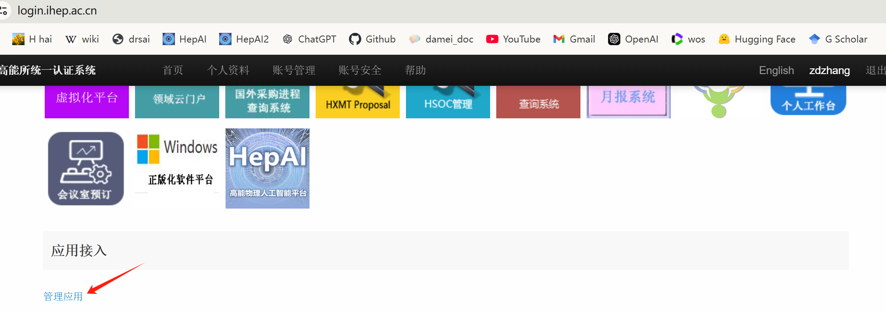

# HepAI-Gradio-Auth-Example

用于Gradio应用的高能所统一认证应用示例


# 快速开始；


## 1. 安装依赖

1.1 安装依赖库
```bash
pip install -r requirements.txt
```
1.2 获取和配置统一认证客户端

+ 使用统一认证登录[login.ihep.ac.cn](https://login.ihep.ac.cn)获取`client_id`、`client_secret`和`redirect_uri`。
<div style="text-align: center;">
    
</div>

+ 点击`管理应用`-`添加新的应用接入`，填写应用名称、应用描述、应用回调地址等信息，点击`保存`。
+ 等待审核通过后可查看`client_id`、`client_secret`和`redirect_uri`。
+ 将`client_id`、`client_secret`和`redirect_uri`配置到`.env`中。

## 2. 运行示例

```bash
python gradio_sso.py
```

注意：统一认证由`login.ihep`发起回调，需要在在`redirect_uri`中配置服务器的回调地址才能正常工作，例如：`http://localhost:7860/umt/callback`

浏览器打开[http://localhost:7860](http://localhost:7860)即可查看示例。


# Contributors

- luoq@ihep.ac.cn
- zdzhang@ihep.ac.cn